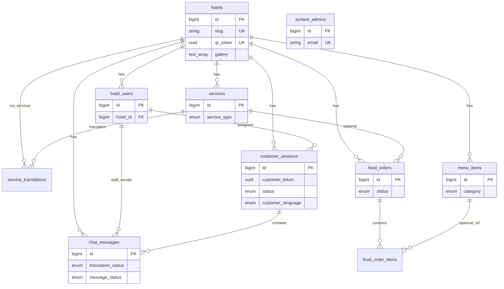

# Kiến trúc dự án A25 Server

Tài liệu này giúp developer mới nắm nhanh **mục tiêu hệ thống**, **cấu trúc mã nguồn**, và **mô hình database** của backend NestJS trong monorepo A25.

---

## 1. Tổng quan

**A25 Server** là API backend cho nền tảng quản lý khách sạn đa tenant (multi-hotel):

| Luồng nghiệp vụ | Mô tả ngắn |
|-----------------|------------|
| **Quản trị hệ thống** | Super admin tạo/quản lý khách sạn, tài khoản hotel admin |
| **Quản trị khách sạn** | Hotel admin cấu hình dịch vụ, thực đơn, xử lý đơn F&B, chat khách |
| **Khách hàng (guest)** | Quét QR khách sạn → xem thông tin, chat có dịch đa ngôn ngữ, đặt món |

**Stack chính**

- **Runtime:** Node.js + [NestJS](https://nestjs.com) 11
- **ORM:** [TypeORM](https://typeorm.io) 0.3 + PostgreSQL
- **Realtime:** Socket.IO (`/chat` namespace)
- **Upload ảnh:** Cloudinary (module `uploads`)
- **Dịch chat:** Google Translate API (tùy chọn, qua `GOOGLE_TRANSLATE_API_KEY`)
- **Auth:** JWT tự ký (HS256, `crypto` — không dùng `@nestjs/jwt`)
- **API docs:** Swagger tại `/api/docs`

---

## 2. Cấu trúc thư mục

```
server/
├── src/
│   ├── main.ts                 # Bootstrap, CORS, ValidationPipe, Swagger
│   ├── app.module.ts           # Gom các feature module
│   ├── database/
│   │   ├── database.module.ts  # TypeORM + Postgres config
│   │   └── seeds/              # seed.ts gom schema + data, reset-db.ts
│   ├── auth/                   # Login, JWT, guard
│   ├── hotels/                 # CRUD khách sạn, QR token
│   ├── hotel-users/            # Admin từng khách sạn
│   ├── services/               # Dịch vụ khách sạn + bản dịch đa ngôn ngữ
│   ├── chat/                   # Session chat, message, WebSocket, dịch
│   ├── food-order/             # Thực đơn + đơn đặt món F&B
│   ├── uploads/                # Upload ảnh Cloudinary
│   └── system-admins/          # Entity super admin (chỉ entity, không có module riêng)
├── docs/
│   └── ARCHITECTURE.md         # File này
└── test/                       # E2E Jest
```

Mỗi feature module thường có: `*.module.ts`, `*.controller.ts`, `*.service.ts`, `entities/`, `dto/`.

**Entity TypeORM** (ánh xạ bảng đang dùng trong code):

| File entity | Bảng DB |
|-------------|---------|
| `hotels/entities/hotel.entity.ts` | `hotels` |
| `system-admins/entities/system-admin.entity.ts` | `system_admins` |
| `hotel-users/entities/hotel-user.entity.ts` | `hotel_users` |
| `services/entities/service.entity.ts` | `services`, `service_translations` |
| `chat/entities/chat.entity.ts` | `customer_sessions`, `chat_messages` |
| `food-order/entities/menu-item.entity.ts` | `menu_items` |
| `food-order/entities/food-order.entity.ts` | `food_orders`, `food_order_items` |

---

## 3. Mô hình tenant & phân quyền

### 3.1 Ranh giới dữ liệu

- **Tenant = một khách sạn** (`hotels.id`).
- Hầu hết bảng nghiệp vụ có `hotel_id` và được lọc theo khách sạn khi hotel admin gọi API.
- Khách không đăng nhập: nhận diện qua **`qr_token`** (UUID trên `hotels`) hoặc **`customer_token`** (UUID trên `customer_sessions`).

### 3.2 Hai loại người dùng đăng nhập

| Loại | Bảng | `scope` JWT | Ghi chú |
|------|------|-------------|---------|
| **System admin** | `system_admins` | `system` | Quản lý toàn platform, không gắn `hotel_id` |
| **Hotel admin** | `hotel_users` | `hotel` | Một manager/owner cho **một** `hotel_id`; **không còn cột `role`** |

Soft-delete hotel user: `hotel_users.deleted_at IS NULL`.

### 3.3 Auth flow

```
POST /auth/login  →  { access_token, user }
GET  /auth/me     →  Bearer token  →  profile (scope system | hotel)
```

- Header: `Authorization: Bearer <token>`
- Guard: `JwtAuthGuard` trên route admin
- Token TTL: 7 ngày (`JWT_SECRET` trong `.env`)

---

## 4. Các module API (REST)

Prefix mặc định: `http://localhost:3000` (hoặc `PORT`).

| Module | Prefix | Vai trò |
|--------|--------|---------|
| `auth` | `/auth` | Đăng nhập, profile |
| `hotels` | `/hotels` | CRUD khách sạn, lookup theo `slug` / `qr/:qrToken` |
| `hotel-users` | `/hotel-users` | CRUD admin khách sạn (system scope) |
| `services` | `/services` | Dịch vụ + `service_translations` (đa ngôn ngữ) |
| `chat` | `/chat` | Session, tin nhắn, dịch, danh sách session theo hotel |
| `food-order` | `/food-order` | Menu công khai, đặt đơn; admin menu/orders/stats |
| `uploads` | `/uploads` | `POST /uploads/image` → Cloudinary |

**WebSocket:** namespace `/chat` — join room theo `sessionId`, realtime tin nhắn / trạng thái session.

Chi tiết request/response: mở **Swagger** `/api/docs` khi server đang chạy.

---

## 5. Database

### 5.1 Công nghệ & cấu hình

- **Engine:** PostgreSQL
- **Database mặc định:** `a25_db` (biến `DB_NAME`)
- **Extensions:** `pgcrypto`, `uuid-ossp` (tạo trong seed)

Biến môi trường (`.env` / `.env.local`):

| Biến | Ý nghĩa |
|------|---------|
| `DB_HOST`, `DB_PORT`, `DB_USERNAME`, `DB_PASSWORD`, `DB_NAME` | Kết nối Postgres |
| `DB_SYNCHRONIZE` | `true`: TypeORM tự sync schema từ entity; `false`: chỉ dùng seed SQL (khuyến nghị sau khi schema ổn định) |
| `DATABASE_URL` | Chuỗi kết nối (một số tool khác có thể dùng) |
| `JWT_SECRET` | Ký JWT |
| `SYSTEM_ADMIN_*` | Tài khoản seed cho system admin |
| `GOOGLE_TRANSLATE_API_KEY` | Dịch tin nhắn chat |
| `CLOUDINARY_*` | Upload ảnh |

### 5.2 Quản lý schema local

Migration SQL cũ và các cải tiến schema hiện tại đã được gom vào `src/database/seeds/seed.ts`. Seed là nguồn schema chính cho cả DB mới và DB đã có dữ liệu.

| Cơ chế | Lệnh | Vai trò |
|--------|------|---------|
| **Seed SQL** | `pnpm run seed` | Tạo/cập nhật schema + dữ liệu mẫu (idempotent). Bao gồm schema hoàn chỉnh, indexes, FK và check constraints. |
| **TypeORM synchronize** | `DB_SYNCHRONIZE=true` | Tự đồng bộ entity → DB khi app khởi động. **Không an toàn với enum** — tắt khi production. |

**Khuyến nghị cho dev mới (DB trống):**

```bash
pnpm install
# Cấu hình .env (copy từ .env mẫu)
pnpm run db:fresh    # reset-db + seed
pnpm run start:dev
```

**DB đã có dữ liệu:** chạy `pnpm run seed` để bổ sung schema còn thiếu và giữ dữ liệu hiện có.
**Production/staging:** ưu tiên `DB_SYNCHRONIZE=false`, build server, rồi chạy `pnpm run seed` khi cần cập nhật schema.

| Script | Mô tả |
|--------|--------|
| `pnpm run seed` | Schema + sample data, chạy lại an toàn |
| `pnpm run db:reset` | Xóa DB (reset-db.ts) |
| `pnpm run db:fresh` | Reset + seed |

### 5.3 Sơ đồ quan hệ (bảng đang dùng trong code)



### 5.4 Bảng nghiệp vụ chính

#### `hotels`

Trung tâm tenant: tên, slug, liên hệ, mô tả, logo/banner, **`gallery`** (`text[]` URL ảnh), **`qr_token`** (UUID cho landing guest).

#### `system_admins` / `hotel_users`

Lưu `password_hash` (bcrypt). Email hotel user unique theo cặp `(hotel_id, email)` — index `idx_hotel_users_hotel_email`.

#### `services` + `service_translations`

- Dịch vụ hiển thị trên app khách (icon, ảnh, `sort_order`, soft-delete `deleted_at`).
- `service_type`: `content` | `food_order` (migration `003`) — liên kết luồng đặt món.
- Bản dịch: một row / `(service_id, language)` với `language_code` enum.

#### `customer_sessions` + `chat_messages`

- **Session:** khách quét QR → tạo session với `customer_token`, ngôn ngữ `customer_language`, thông tin booking (phòng, check-in/out, …), trạng thái `chat_session_status`, `assigned_user_id`.
- **Message:** `sender_type` CUSTOMER | STAFF; pipeline dịch (`original_message`, `translated_message`, `translation_status`); delivery `message_status`; hỗ trợ `IMAGE`, `ORDER`, `SYSTEM`.

#### `menu_items` + `food_orders` + `food_order_items`

Module **food-order** hiện tại (không dùng bảng `orders` / `order_items` cũ trong seed):

- **Menu:** `category` enum `food` | `drink`; tên/mô tả VI + EN inline (`name`, `name_en`, …); giá `decimal`; soft-delete `deleted_at`.
- **Đơn:** `food_order_status` PENDING → ACCEPTED/REJECTED → COMPLETED/CANCELLED; snapshot dòng đơn trong `food_order_items` (tên + giá tại thời điểm đặt).

### 5.5 Bảng legacy (seed, chưa có module NestJS)

Script `seed.ts` vẫn tạo các bảng sau để tương thích DB cũ / dữ liệu mẫu. **Code runtime không đọc/ghi** qua TypeORM:

| Bảng | Ghi chú |
|------|---------|
| `menu_categories`, `menu_category_translations` | Mô hình category + dịch cũ |
| `menu_item_translations` | Dịch tên món tách bảng (đã gộp vào cột trên `menu_items` sau migration 004) |
| `orders`, `order_items` | Đơn F&B kiểu cũ (`order_status`, nguồn CHAT/QR/…) |
| `notifications` | Thông báo nội bộ (chưa implement API) |
| `media_files` | Metadata file upload (hiện upload trực tiếp Cloudinary) |

`seed.ts` backfill từ schema legacy sang cột mới trên `menu_items` và cho phép `category_id` NULL để insert chỉ dùng enum `category`.

Khi thiết kế tính năng mới, **ưu tiên bảng có entity TypeORM**; tránh thêm logic vào bảng legacy trừ khi có kế hoạch migrate rõ ràng.

### 5.6 PostgreSQL ENUMs (tham chiếu)

| Enum | Giá trị (tóm tắt) |
|------|-------------------|
| `language_code` | vi, en, ja, zh, ko, th |
| `chat_session_status` | OPEN, ASSIGNED, BOOKED, CLOSED |
| `message_sender_type` | CUSTOMER, STAFF |
| `message_type` | TEXT, IMAGE, SYSTEM, ORDER |
| `translation_status` | PENDING, TRANSLATED, FAILED, SKIPPED |
| `message_status` | SENDING, SENT, DELIVERED, READ, FAILED |
| `service_type` | content, food_order |
| `menu_category` | food, drink |
| `food_order_status` | PENDING, ACCEPTED, REJECTED, COMPLETED, CANCELLED |
| `order_status` (legacy) | PENDING, CONFIRMED, PREPARING, READY, COMPLETED, CANCELLED |
| `order_source_type` (legacy) | CHAT, WALKIN, PHONE, QR |
| `notification_type` (legacy) | NEW_ORDER, NEW_MESSAGE, ORDER_STATUS, SYSTEM |

> **Lưu ý:** TypeORM `synchronize` có thể làm hỏng enum Postgres (drop/recreate). Khi schema đã ổn định, ưu tiên `DB_SYNCHRONIZE=false` và cập nhật `seed.ts` khi đổi schema local.

### 5.7 Index & ràng buộc đáng nhớ

- Chat: `idx_customer_sessions_hotel_status_msg`, `idx_chat_messages_hotel_session_created`
- Hotel users: `uq_hotel_users_hotel_email_active` cho email unique theo hotel nhưng cho phép tái sử dụng sau soft-delete; `idx_hotel_users_active_email` cho login theo email.
- Chat: `idx_customer_sessions_hotel_activity` hỗ trợ danh sách session theo hoạt động mới nhất; `idx_chat_messages_session_sender_unread` hỗ trợ mark-read.
- Menu: `idx_menu_items_public_sort` hỗ trợ public/admin menu theo `hotel_id`, trạng thái, sort.
- Food orders: `idx_food_orders_hotel_status`, `idx_food_orders_created`, `idx_food_orders_hotel_status_created`
- FK xóa hotel: CASCADE trên hầu hết bảng con; `hotel_users` → RESTRICT

### 5.8 Ràng buộc dữ liệu mới

`seed.ts` tạo trực tiếp các check constraint này cho DB mới, đồng thời bổ sung chúng bằng `ALTER TABLE ... ADD CONSTRAINT ... NOT VALID` cho DB đã có dữ liệu:

| Bảng | Ràng buộc |
|------|-----------|
| `customer_sessions` | `unread_count >= 0`, `guest_count > 0` nếu có, `check_out_date >= check_in_date` nếu có đủ ngày |
| `food_orders` | `total_amount >= 0` |
| `food_order_items` | `unit_price >= 0`, `quantity > 0` |

`NOT VALID` vẫn kiểm tra dữ liệu mới/cập nhật mới nhưng không scan toàn bộ bảng ngay khi deploy. Sau khi kiểm tra dữ liệu production sạch, có thể chạy `ALTER TABLE ... VALIDATE CONSTRAINT ...` trong một migration riêng.

---

## 6. Luồng dữ liệu tiêu biểu

### 6.1 Khách vào từ QR

```
GET /hotels/qr/:qrToken  →  hotel + services
POST /chat/sessions      →  customer_session + customer_token
(WebSocket /chat)        →  realtime messages + translation
```

### 6.2 Hotel admin xử lý chat

```
POST /auth/login (scope hotel)
GET /chat/hotel/:hotelId/sessions
PATCH /chat/sessions/:id/status
POST .../messages/staff/:userId
```

### 6.3 Đặt món F&B

```
GET  /food-order/menu/hotel/:hotelId     (public)
POST /food-order/orders                  (guest)
GET  /food-order/admin/orders/hotel/:id  (admin + JWT)
PATCH /food-order/admin/orders/:id/status
```

---

## 7. Dịch vụ ngoài & file cấu hình

| Dịch vụ | Module | Env |
|---------|--------|-----|
| Cloudinary | `uploads` | `CLOUDINARY_CLOUD_NAME`, `CLOUDINARY_API_KEY`, `CLOUDINARY_API_SECRET`, `CLOUDINARY_FOLDER` |
| Google Translate | `chat/translation.service` | `GOOGLE_TRANSLATE_API_KEY` (để trống → dịch bỏ qua / SKIPPED) |

`ConfigModule` load `.env.local` trước `.env` (override local, gitignore secrets).

---

## 8. Checklist onboarding

1. Cài Postgres local, tạo database `a25_db`.
2. Copy/cấu hình `.env` (JWT, DB, Cloudinary nếu test upload).
3. `pnpm install` → `pnpm run db:fresh`.
4. `pnpm run start:dev` → mở `/api/docs`.
5. Đăng nhập thử:
   - System: `SYSTEM_ADMIN_EMAIL` / `SYSTEM_ADMIN_PASSWORD` (mặc định seed: `admin@system.com` / `admin123`).
   - Hotel: `manager@grandpalace.vn` / `staff123` (sau seed).
6. Đọc entity tương ứng module trước khi sửa schema — cập nhật `seed.ts` + entity, không chỉ dựa vào `synchronize`.

---

## 9. Ghi chú phát triển

- **ID:** `bigint` auto-increment (`BIGSERIAL`); API/JSON thường là `number`.
- **Tiền:** `decimal(12,2)` — TypeORM trả về `string` trên entity.
- **Thời gian:** `timestamptz` + `created_at` / `updated_at`.
- **Đa ngôn ngữ dịch vụ:** bảng `service_translations`; menu F&B: cột `name` / `name_en` trực tiếp trên `menu_items`.
- **Swagger tags** trong `main.ts` chưa liệt kê hết module (`chat`, `food-order`) — vẫn xuất hiện trên document nếu controller có decorator.

Khi thêm bảng mới: tạo entity → cập nhật schema idempotent trong `seed.ts` → cập nhật tài liệu này và data demo nếu cần.

---

*Tài liệu phản ánh codebase tại nhánh hiện tại. Nếu schema và code lệch nhau, ưu tiên **entity TypeORM** + `src/database/seeds/seed.ts`.*
